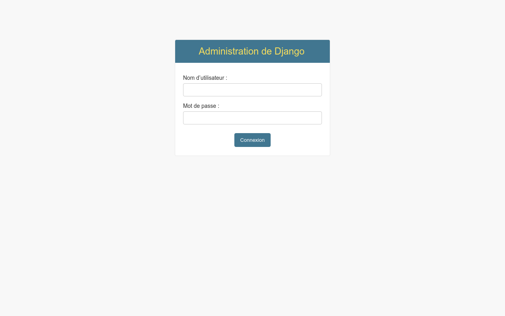

# 🎓 Don Bosco Connect

<div align="center">


**La Plateforme Éducative Intégrée pour l'École Moderne**

[English](README.md) · [Français](README.md) · [العربية](README.ar.md)

</div>

---

## 🚀 Présentation

**Don Bosco Connect** est une plateforme éducative complète qui transforme l'expérience d'apprentissage à Don Bosco Tunis. Elle combine gestion administrative rigoureuse, collaboration pédagogique et apprentissage personnalisé par l'IA.

### ✨ Fonctionnalités Principales

| Feature | Description |
|---------|-------------|
| 🤖 **Apprentissage Adaptatif** | Contenu IA qui s'ajuste au niveau de chaque élève |
| 👨‍🏫 **Collaboration** | Connecte élèves, profs et parents |
| 🎮 **Gamification** | XP, badges, niveaux pour rester motivé |
| 📊 **Analytiques Avancées** | Suivi détaillé et alertes prédictives |
| 📱 **Multi-Plateforme** | Web, Desktop (Electron), Mobile (React Native) |

---

## 📸 Captures d'écran

### Page d'accueil


### Connexion


### Tableau de bord Admin


### Tableau de bord Professeur


### Tableau de bord Étudiant


### Tableau de bord Parent


---

## 🖼️ Simulation du Projet

### 📱 Application Mobile

```
┌─────────────────────────────────┐
│  ≡  Don Bosco Connect     🌐 FR  │
├─────────────────────────────────┤
│                                 │
│  ┌───────────────────────────┐   │
│  │  Bienvenue, Ahmed!     🏅 │   │
│  │  Niveau 5    📚 150 XP │   │
│  └───────────────────────────┘   │
│                                 │
│  ├─ 📚 Mes Cours            ─┤ │
│  │   ┌──────┐ ┌──────┐       │
│  │   │Math │ │Phy  │        │
│  │   └──────┘ └──────┘       │
│  │   ┌──────┐ ┌──────┐       │
│  │   │Français│ │Anglais│      │
│  │   └──────┘ └──────┘       │
│  ├─ 📝 Devoirs            ─┤ │
│  │   • Math Ch.3 - demain   │
│  │   • Physique - 25/03     │
│  ├─ 🤖 Mentor IA          ─┤ │
│  │   [____Pose_une_question] │
│  │                         │
│  │   💬 Salut! Comment     │
│  │      peux-je t'aider?   │
│  └─────────────────────────┘   │
│                                 │
│  [🏠] [📚] [📝] [🤖]        │
└─────────────────────────────────┘
```

### 💻 Tableau de Bord Web (Admin)

```
┌────────────────────────────────────────────────────────────────┐
│  Don Bosco Connect                              Admin | John  │
├──────────┬─────────────────────────────────────────────────┤
│          │                                             │
│ 📊 Dash │  STATISTIQUES GLOBALES                      │
│ 👥 Élèves│  ┌────────┐ ┌────────┐ ┌────────┐ ┌────┐ │
│ 👨‍🏫 Profs│  │ 245   │ │  42   │ │  15   │ │  8  │ │
│ 📚 Classes│ │Élèves │ │ Profs  │ │Classes│ │Mat.│ │
│ 📊 Analyt│  └────────┘ └────────┘ └────────┘ └────┘ │
│ ⚙️ Config│                                          │
│          │  ALERTES DÉCROCHAGE                      │
│          │  ┌────────────────────────────────┐   │
│          │  │ ⚠️ Ali Ben Ali - Risque élevé  │   │
│          │  │ • Absences: 15/20              │   │
│          │  │ • Notes: 8.5/20               │   │
│          │  │ [Contacter la famille]          │   │
│          │  └────────────────────────────────┘   │
│          │                                          │
│  Sortie │  DERNIÈRES ACTIVITÉS                    │
│  🚪   │  • Prof. Martin a ajouté un cours    │
│          │  • Quiz Mathématiques complété       │
│          │  • Nouveau message de parent       │
└──────────┴────────────────────────────────────────┘
```

### 🎓 Dashboard Élève

```
┌────────────────────────────────────────────────────────────────┐
│  Don Bosco Connect                     Ahmed | Classe: 3ème-A  │
├──────────┬─────────────────────────────────────────────────┤
│          │                                             │
│ 🏠 Home │  🎮 MON PROGRÈS                             │
│ 📚 Cours│  ┌─────────────────────────────────┐       │
│ 📝 Dev  │  │  📊 Niveau 5    🏅 150 XP       │       │
│ 🤖 IA  │  │  ████████░░░░░░░░  42%        │       │
│ 📊 Prog │  │  Prochain badge: "Premier 100"   │       │
│ 💬 Msgs │  └─────────────────────────────────┘       │
│          │                                          │
│          │  🎯 APPRENTISSAGE ADAPTATIF               │
│          │  ┌─────────────────────────────────┐       │
│          │  │ Sujet: Algèbre                  │       │
│          │  │ Niveau actuel: 65%               │       │
│          │  │ → Exercices intermédiaires       │       │
│          │  │                              │       │
│          │  │ [Générer nouveau quiz]          │       │
│          │  └─────────────────────────────────┘       │
│          │                                          │
│          │  📅 PROCHAINS DEVOIRS                   │
│          │  • Math Ch.3 - Maintenant           │
│          │  • Physique - Demain 12h           │
└──────────┴────────────────────────────────────────┘
```

### 👨‍🏫 Dashboard Professor

```
┌──────────────────────────────────────���─────────────────────────┐
│  Don Bosco Connect                   Prof. Martin | Maths     │
├──────────┬─────────────────────────────────────────────────┤
│          │                                             │
│ 📊 Dash │  MES COURS                                   │
│ 📚 Cours│  ┌─────────────────────────────────┐       │
│ 📝 Dev  │  │ 📚 Mathématiques 3ème           │       │
│ 📊 Analyt│  │ ████████████░░░░  75%         │       │
│ 🤖 IA   │  │ 24 élèves / 30                  │       │
│ 📧 Msgs │  │ [Voir détails] [Modifier]        │       │
│          │  └─────────────────────────────────┘       │
│          │  ┌─────────────────────────────────┐       │
│          │  │ 📚 Mathématiques Terminale       │       │
│          │  │ ████░░░░░░░░░░░  25%         │       │
│          │  │ 8 élèves / 25                  │       │
│          │  └─────────────────────────────────┘       │
│          │                                          │
│          │  🤖 CRÉATION IA                         │
│          │  ┌─────────────────────────────────┐     │
│          │  │[Générer quiz différencié]        │     │
│          │  │[Créer résumé cours]             │     │
│          │  │[Prévoir les difficultés]        │     │
│          │  └─────────────────────────────────┘     │
│          │                                          │
│          │  📊 ANALYTiques CLASSE                   │
│          │  • Moyenne: 14.2/20                     │
│          │  • Difficultés: Algèbre                  │
└──────────┴────────────────────────────────────────┘
```

---

## 🏗️ Architecture

```
┌─────────────────────────────────────────────────────────────────┐
│                    DON BOSCO CONNECT                    │
├─────────────────────────────────────────────────────────────────┤
│                                                          │
│   ┌─────────────────────────────────────────────────┐    │
│   │              FRONTEND (Shared)                  │    │
│   │  ┌─────────┐  ┌──────────┐  ┌──────────┐  │    │
│   │  │  Web    │  │Electron  │  │  Mobile │  │    │
│   │  │React.js │  │ Desktop │  │  Expo   │  │    │
│   │  └─────────┘  └──────────┘  └──────────┘  │    │
│   └─────────────────────────────────────────────────┘    │
│                         │                            │
│                         ▼                            │
│   ┌─────────────────────────────────────────────────┐    │
│   │              API REST (Django)                │    │
│   │  ┌────────┐ ┌───────┐ ┌────────┐ ┌─────┐  │    │
│   │  │Accounts│ │Courses│ │AI     │ │Assign│  │    │
│   │  │  API   │ │ API  │ │ RAG   │ │ments│  │    │
│   │  └────────┘ └───────┘ └────────┘ └─────┘  │    │
│   └─────────────────────────────────────────────────┘    │
│                         │                            │
│                         ▼                            │
│   ┌─────────────────────────────────────────────────┐    │
│   │              DATABASE & AI                       │    │
│   │  ┌──────────────┐        ┌────────���─────┐      │    │
│   │  │ PostgreSQL  │        │   Ollama   │      │    │
│   │  │  + pgvector │        │  (Qwen)    │      │    │
│   │  └──────────────┘        └──────────────┘      │    │
│   └─────────────────────────────────────────────────┘    │
└─────────────────────────────────────────────────────┘
```

---

## 🔧 Tech Stack

| Composant | Technologie |
|----------|-----------|
| **Backend API** | Django 5.0 + Django REST Framework |
| **Base de données** | PostgreSQL + pgvector |
| **Moteur IA** | Ollama (Qwen 2.5) |
| **Frontend Web** | React 19 + Vite |
| **Desktop** | Electron |
| **Mobile** | React Native (Expo) |
| **i18n** | i18next (Web), i18n-js (Mobile) |

---

## 🚦 Démarrage Rapide

### Backend

```bash
cd backend
cp env.example .env
pip install -r requirements.txt
python manage.py migrate
python manage.py runserver
```

### Frontend Web

```bash
cd web
npm install
npm run dev        # Development
npm run electron:dev  # With Electron
```

### Mobile

```bash
cd mobile
npx expo start
```

---

## 🤖 Intelligence Artificielle

### Formule de Niveau Adaptatif

```
Niveau = (Score_Quiz × 0.6) + (Vitesse_Réponse × 0.4)
```

### Fonctionnalités IA

- **RAG (Retrieval Augmented Generation)** : Réponses basées sur le contenu des cours
- **Quiz Différenciés** : Génération automatique selon le niveau
- **Analyse de Risque** : Détection des élèves en difficulté
- **Mentor 24/7** : Chatbot disponible à tout moment

---

## 🔐 Rôles Utilisateurs

| Rôle | Permissions |
|------|------------|
| 👑 **Admin** | Gestion complète, analytiques, alertes déchet |
| 👨‍🏫 **Prof** | Cours, devoirs, notes, IA assistant |
| 🎓 **Élève** | Cours, devoirs, mentor IA, gamification |
| 👪 **Parent** | Suivi enfant, messaging |

---

## 📝 License

Copyright © 2024 Don Bosco Tunis. Tous droits réservés.

---

<div align="center">

**Développé avec ❤️ pour l'éducation**

[Site Web](https://donbosco.tn) · [Signaler un bug](https://github.com/HiTechTN/don-bosco-connect/issues)

</div>