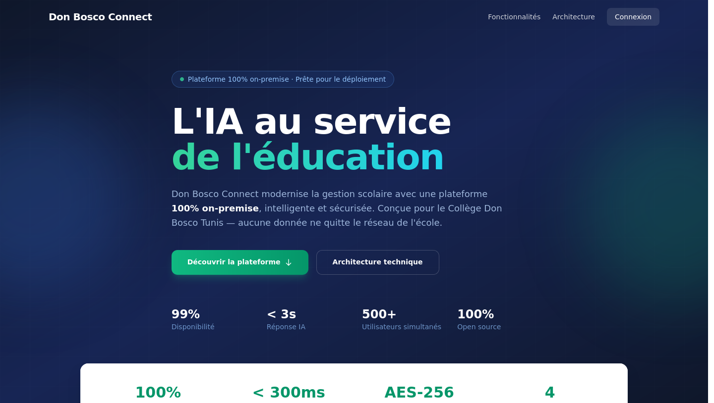
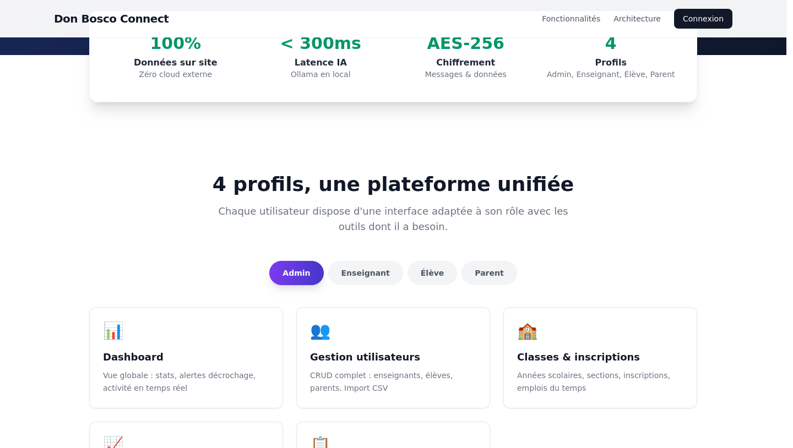
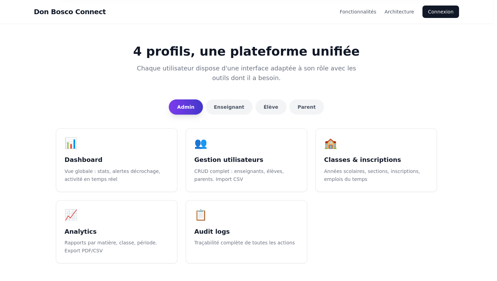
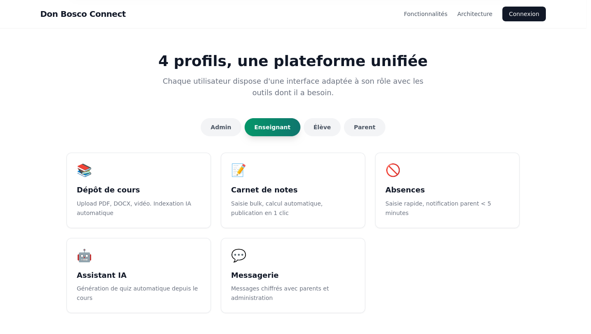
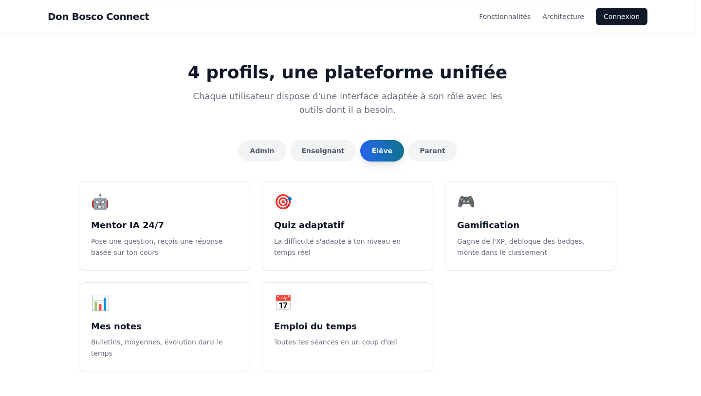
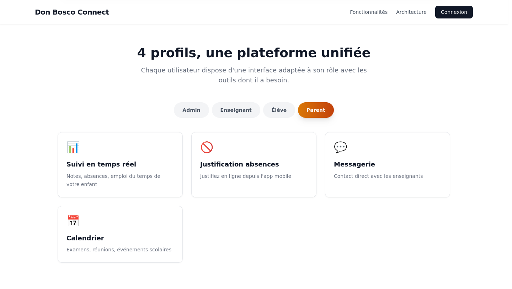

# Don Bosco Connect

[](https://github.com/HiTechTN/don-bosco-connect/actions/workflows/ci.yml)
[](https://github.com/HiTechTN/don-bosco-connect/actions/workflows/deploy-pages.yml)
[](https://github.com/HiTechTN/don-bosco-connect/actions/workflows/publish.yml)
[](https://github.com/HiTechTN/don-bosco-connect/pkgs/container/don-bosco-connect%2Fbackend)

Plateforme éducative sur-mesure pour le **Collège Don Bosco Tunis**.  
Stack full **on-premise** : IA locale (Ollama), base vectorielle (pgvector), chiffrement AES-256, MFA, et notifications temps réel.

---

## Architecture

```
┌─────────────────────────────────────────────────────┐
│                    Frontend                          │
│  React 18 + Vite + Tailwind (Web)                   │
│  React Native + Expo 54 (Mobile)                    │
└──────────┬──────────────────────────┬───────────────┘
           │ HTTP/WS                   │ HTTPS
┌──────────▼──────────────────────────▼───────────────┐
│                    Nginx 1.25                        │
│  TLS 1.3 · Rate limiting · Security headers         │
└──────────┬──────────────────────────┬───────────────┘
           │                          │
┌──────────▼──────────┐  ┌───────────▼───────────────┐
│   FastAPI 0.115      │  │   Celery 5.3 + Redis 7.2 │
│   SQLAlchemy 2.0     │  │   Worker / Beat / Flower  │
│   JWT + MFA + AES    │  └───────────────────────────┘
└──────────┬───────────┘
           │
┌──────────▼──────────────────┐  ┌──────────────────┐
│  PostgreSQL 16 + pgvector   │  │   Ollama          │
│  Données : users, notes,    │  │   qwen2.5:7b      │
│  absences, messages (AES)   │  │   nomic-embed-text│
│  Vecteurs IA (cosine dist)  │  │   (RAG pipeline)  │
└─────────────────────────────┘  └──────────────────┘
           │
┌──────────▼──────────┐
│   MinIO (S3)        │
│   Cours PDF/DOCX    │
└─────────────────────┘
```

### Services

| Service | Image | Port | Rôle |
|---------|-------|------|------|
| `db` | postgres:16 + pgvector | 5432 | Base de données |
| `redis` | redis:7.2-alpine | 6379 | Cache / files d'attente |
| `minio` | minio/minio | 9000/9001 | Stockage fichiers |
| `ollama` | ollama/ollama | 11434 | LLM local (Qwen 2.5) |
| `api` | custom | 8000 | FastAPI (backend) |
| `worker` | custom | - | Celery worker |
| `beat` | custom | - | Celery beat (tâches planifiées) |
| `flower` | custom | 5555 | Monitoring Celery |
| `frontend` | custom | 5173 | Vite dev server |
| `nginx` | nginx:1.25-alpine | 80/443 | Reverse proxy |
| `prometheus` | prom/prometheus | 9090 | Métriques |
| `grafana` | grafana/grafana | 3000 | Dashboards |

---

## Démonstration

> ### Accéder à la démo en ligne : [hitechtn.github.io/don-bosco-connect](https://hitechtn.github.io/don-bosco-connect/)

### Page d'accueil



### Indicateurs clés



### Fonctionnalités par profil

| Admin | Enseignant |
|-------|-----------|
|  |  |

| Élève | Parent |
|-------|--------|
|  |  |

### Aperçu complet


---

## Installation

### ⚡ Installation automatique (recommandé)

Une seule commande pour tout installer (Docker, clés sécurisées, base de données, modèles IA) :

```bash
curl -sSL https://raw.githubusercontent.com/HiTechTN/don-bosco-connect/main/scripts/install.sh | bash
```

> Détection automatique de Docker / Podman, génération de clés AES-256, migration de la base, seed des données de démonstration, téléchargement des modèles Ollama (Qwen 2.5 + nomic-embed-text).  
> Compatible : Ubuntu, Debian, Fedora, Arch Linux, macOS (via Docker Desktop).

#### Mode GHCR (images pré-construites)

Utilisez les images Docker pré-construites depuis **GitHub Container Registry** au lieu de compiler localement :

```bash
USE_GHCR=1 GHCR_TOKEN=<github_token> curl -sSL https://raw.githubusercontent.com/HiTechTN/don-bosco-connect/main/scripts/install.sh | bash
```

Le token GitHub nécessite la permission `read:packages`.  
Si `gh` CLI est installé et authentifié, le token est détecté automatiquement.

```bash
# Alternative avec gh CLI
USE_GHCR=1 GHCR_TOKEN=$(gh auth token) curl ... | bash
```

### 📦 Installation manuelle

#### Prérequis

- Docker & Docker Compose v2 (ou Podman)
- GPU NVIDIA recommandé pour Ollama (fonctionne aussi sur CPU)

#### 1. Cloner

```bash
git clone https://github.com/HiTechTN/don-bosco-connect.git
cd don-bosco-connect
```

#### 2. Configurer l'environnement

```bash
./scripts/setup.sh
```

Ce script génère automatiquement :
- Les clés secrètes `SECRET_KEY` et `ENCRYPTION_KEY` (AES-256)
- Les mots de passe pour PostgreSQL, Redis, MinIO, Grafana
- Les certificats SSL auto-signés pour le développement

#### 3. Lancer la stack

```bash
./scripts/start.sh
```

> Démarrage progressif : infrastructure (DB, Redis, MinIO) → Ollama → API → Workers → Frontend.

Ou étape par étape :

```bash
# Compilation locale
docker compose up -d

# Ou utiliser les images pré-construites depuis GitHub Container Registry :
docker compose -f docker-compose.yml -f docker-compose.ghcr.yml up -d

docker compose exec api python scripts/init_db.py # Seed la base
docker compose exec ollama ollama pull qwen2.5:7b-instruct  # Modèle chat
docker compose exec ollama ollama pull nomic-embed-text      # Modèle embedding
```

#### 4. Accéder

| Interface | URL |
|-----------|-----|
| Application | http://localhost:80 |
| API (docs) | http://localhost:8000/docs |
| MinIO Console | http://localhost:9001 |
| Flower (Celery) | http://localhost:5555 |
| Grafana | http://localhost:3001 |

### Comptes de démonstration

| Rôle | Email | Mot de passe |
|------|-------|-------------|
| Admin | admin@donbosco.tn | admin123! |
| Enseignant | karim.hamdi@donbosco.tn | teacher123! |
| Élève | adam.slim@donbosco.tn | student123! |
| Parent | ahmed.slim@parent.tn | parent123! |

### Scripts disponibles

| Script | Usage |
|--------|-------|
| `scripts/install.sh` | Installation automatique complète (curl \| bash) |
| `scripts/setup.sh` | Configuration post-clonage (.env, SSL, clés) |
| `scripts/start.sh` | Démarrage progressif de la stack |
| `scripts/stop.sh` | Arrêt de tous les services |
| `scripts/reset.sh` | Réinitialisation complète (⚠️ supprime les données) |
| `scripts/healthcheck.sh` | Diagnostic de tous les services |
| `scripts/backup.sh` | Sauvegarde PostgreSQL |
| `start_demo.sh` | Démo rapide (backend SQLite + frontend Vite, sans Docker) |

---

## Développement

### Backend

```bash
# Python 3.12+ requis
cd backend
python -m venv .venv && source .venv/bin/activate
pip install -r requirements.txt

# Variables d'environnement
cp .env.example .env

# Lancer (hors Docker)
uvicorn app.main:app --reload --port 8000

# Tests
pytest -v
```

### Frontend web

```bash
cd frontend
npm install
npm run dev      # http://localhost:5173
npm run build    # Production
```

### Mobile (React Native)

```bash
cd mobile
npm install
npx expo start
```

### Générer la démo vidéo

```bash
pip install gtts moviepy pillow numpy
python demo/generate_audio.py   # TTS
python demo/generate_video.py   # Montage
```

### Captures d'écran (README)

```bash
# Avec la stack lancée (http://localhost:5173) :
pip install playwright selenium webdriver-manager
python scripts/capture_screenshots.py
```

---

## API

Documentation interactive (OpenAPI) : `https://donbosco.local/api/docs`

### Endpoints principaux

| Méthode | Route | Description |
|---------|-------|-------------|
| POST | `/api/v1/auth/login` | Authentification |
| POST | `/api/v1/auth/refresh` | Rafraîchir JWT |
| POST | `/api/v1/auth/mfa/setup` | Activer MFA TOTP |
| GET | `/api/v1/users` | Liste utilisateurs (admin) |
| POST | `/api/v1/courses` | Créer un cours |
| POST | `/api/v1/courses/{id}/upload` | Uploader un fichier PDF/DOCX |
| GET | `/api/v1/ai/chat/{conv_id}` | Chat avec Mentor IA (SSE) |
| POST | `/api/v1/ai/quiz/generate` | Générer un quiz |
| POST | `/api/v1/ai/quiz/submit` | Soumettre un quiz (score adaptatif) |
| GET | `/api/v1/gamification/profile` | Profil XP / niveau |
| GET | `/api/v1/gamification/leaderboard` | Classement |
| GET | `/api/v1/gamification/at-risk` | Élèves à risque décrochage |
| WS | `/ws/v1/notifications?token=` | WebSocket notifications |
| WS | `/ws/v1/ai/stream/{conv_id}?token=` | WebSocket streaming IA |

---

## Sécurité

- **JWT** : access token 15 min, refresh token 7 jours
- **MFA** : TOTP obligatoire pour admin & enseignants
- **Chiffrement** : AES-256-GCM pour les messages privés
- **Headers** : HSTS, CSP, X-Frame-Options, X-Content-Type-Options
- **Rate limiting** : 20 req/s API, 5 req/m login
- **On-premise** : aucune donnée en dehors du réseau local

---

## Fonctionnalités

- **IA RAG locale** : déposez un PDF, l'IA répond basée sur le cours via pgvector + Ollama
- **Quiz adaptatif** : score pondérant rapidité et historique (remediation / normal / advanced)
- **Gamification** : XP, badges (7 disponibles), streaks, leaderboard
- **Décrochage** : algorithme prédictif pondérant absences (35%), niveau adaptatif (30%), streaks (15%)
- **Notifications temps réel** : WebSocket pour absences, notes, etc.
- **Messagerie chiffrée** : AES-256-GCM entre parents, enseignants, administration
- **Tableaux de bord analytics** : usage IA, distribution notes, statistiques quiz
- **Application mobile** : React Native / Expo avec authentification MFA

---

## Déploiement

### Production

```bash
docker compose -f docker-compose.yml -f docker-compose.prod.yml up -d
```

Variables requises dans `.env` :
- `SECRET_KEY` (32+ caractères)
- `ENCRYPTION_KEY` (32 bytes hex)
- `POSTGRES_PASSWORD`
- `MINIO_ROOT_PASSWORD`

### Sauvegarde

```bash
./scripts/backup.sh          # DB PostgreSQL → /backups/postgres/
```

Rétention : 30 jours (configurable dans le script).  
Pour une sauvegarde complète (DB + MinIO) :

```bash
docker compose exec minio mc alias set local http://localhost:9000 $MINIO_ROOT_USER $MINIO_ROOT_PASSWORD
docker compose exec minio mc mirror local/courses /backups/minio/
```

---

## Structure du projet

```
don-bosco-connect/
├── backend/
│   ├── app/
│   │   ├── api/v1/           # Routeurs FastAPI
│   │   ├── core/             # Sécurité, permissions, exceptions
│   │   ├── models/           # SQLAlchemy (base.py)
│   │   ├── schemas/          # Pydantic
│   │   ├── services/         # Logique métier
│   │   ├── workers/          # Tâches Celery
│   │   └── config.py
│   ├── alembic/              # Migrations
│   ├── scripts/              # Seed
│   └── tests/
├── frontend/
│   └── src/
│       ├── components/       # UI Kit + LandingDemo
│       ├── pages/            # admin/ teacher/ student/ parent/
│       ├── lib/              # API helper, utils
│       └── store/            # Zustand
├── mobile/
│   └── src/                  # React Native / Expo
├── demo/                     # Scripts démo (TTS + vidéo + Playwright)
├── assets/                   # Fichiers générés (audio, vidéo)
├── nginx/
├── monitoring/
│   ├── prometheus.yml
│   └── grafana/
├── docker-compose.yml
├── docker-compose.ghcr.yml       # Utilise les images GHCR pré-construites
├── docker-compose.dev.yml
├── .env.example
├── screenshots/               # Captures d'écran (README)
├── scripts/                   # Utilitaires
│   ├── install.sh             # Installation automatique (curl | bash)
│   ├── setup.sh               # Configuration post-clonage
│   ├── start.sh               # Démarrage progressif
│   ├── stop.sh                # Arrêt des services
│   ├── reset.sh               # Réinitialisation complète
│   ├── healthcheck.sh         # Diagnostic des services
│   ├── backup.sh              # Sauvegarde PostgreSQL
│   ├── init_db.py             # Seed des données de démo
│   └── ollama-entrypoint.sh   # Pull automatique des modèles IA
└── docker-compose.dev.yml
```

---

## Démo en ligne

**→ https://hitechtn.github.io/don-bosco-connect/**

## Licence

Propriété du **Collège Don Bosco Tunis** — usage interne uniquement.
